# SkillSync – AI Resume Analyzer & Roadmap Generator

SkillSync is an AI-powered career development platform that analyzes resumes, identifies skill gaps, evaluates job readiness, and generates personalized learning roadmaps to help candidates become industry-ready.

Built using the MERN stack with AI-powered resume parsing and roadmap generation.

---

## Live Demo

Frontend: [skillsync-ai.vercel.app](https://skillsync-ai.vercel.app)

Backend: [skillsync-backend-0y7b.onrender.com](https://skillsync-backend-0y7b.onrender.com)
---

## Features

### Resume Analysis
- Upload PDF resumes
- Extract skills automatically
- Match resume against target role requirements
- Calculate readiness score

### Skill Gap Detection
- Identify missing technical skills
- Categorize skills by priority
- Highlight strengths and weaknesses

### Job Readiness Dashboard
- Readiness percentage
- Match score
- Skill coverage analysis
- Visual skill breakdown

### Personalized Learning Roadmap
- AI-generated learning path
- Topic recommendations
- Learning milestones
- Progress tracking

### Resume Feedback System
- ATS optimization suggestions
- Keyword recommendations
- Resume improvement tips
- Technical writing guidance

### Resource Recommendations
- Documentation
- Courses
- Books
- Practice Platforms
- Community Resources

---

## Tech Stack

### Frontend
- React.js
- Vite
- React Router
- Axios
- Tailwind CSS
- Framer Motion
- Recharts
- Lucide React

### Backend
- Node.js
- Express.js
- Multer
- PDF Parsing

### Deployment
- Vercel (Frontend)
- Render (Backend)

---

## Architecture

User Resume
↓
PDF Upload
↓
Resume Parsing
↓
Skill Extraction
↓
Gap Analysis
↓
Readiness Score Calculation
↓
Roadmap Generation
↓
Feedback & Recommendations

---

# Screenshots

## Landing Page

### Hero Section

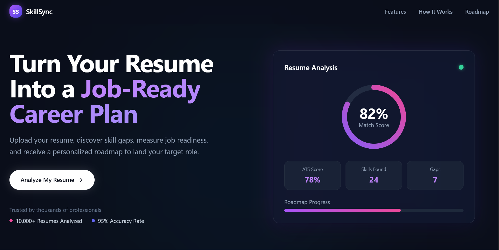

### Features

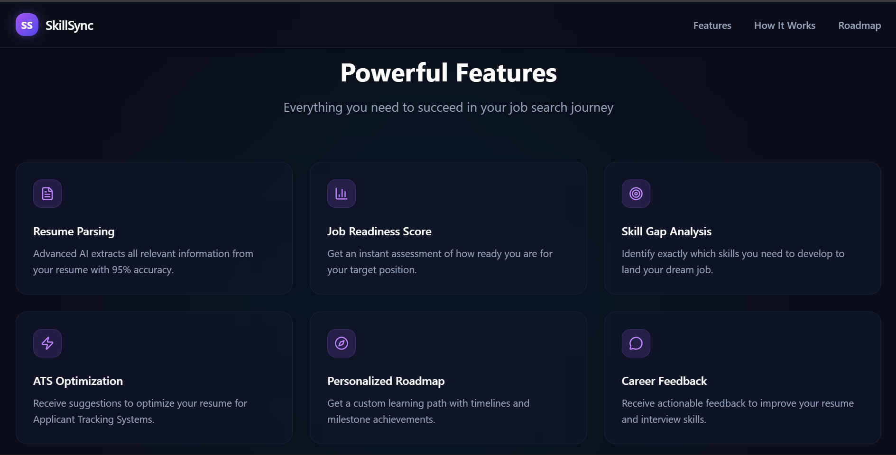

### Readiness Preview

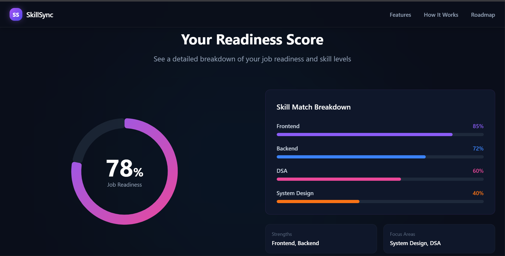

---

## Resume Upload

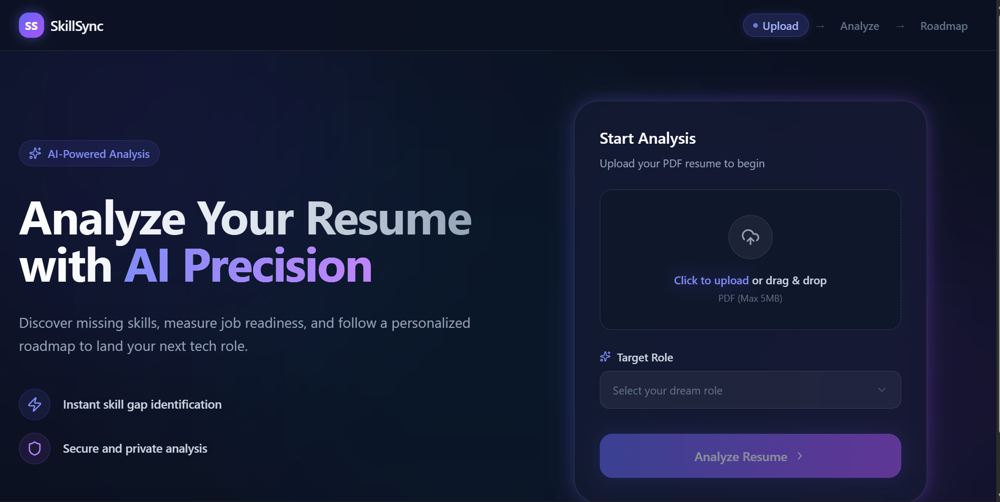

---

## Dashboard

### Resume Analysis Dashboard

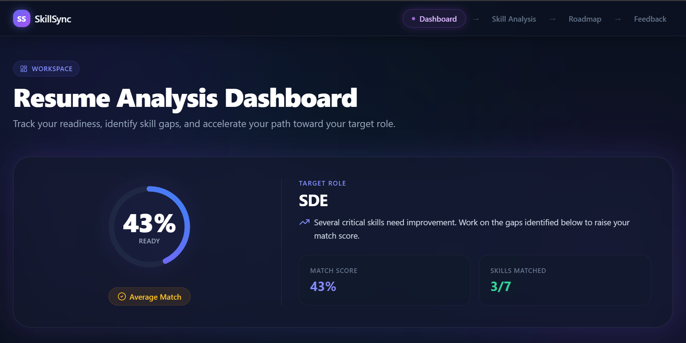

### Skill Breakdown

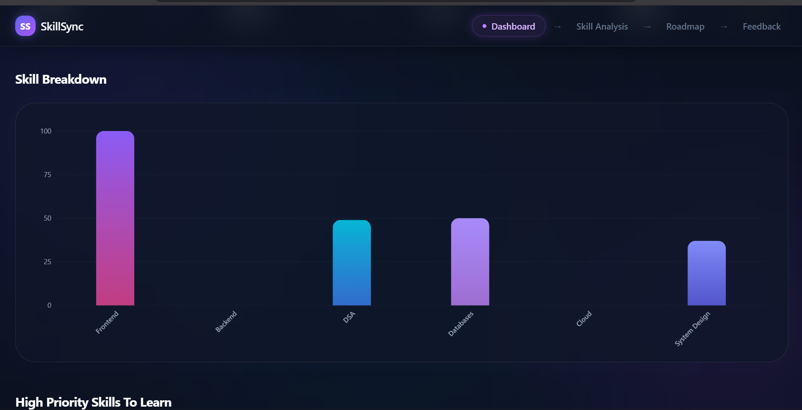

---

## Skill Analysis

### Detected & Missing Skills

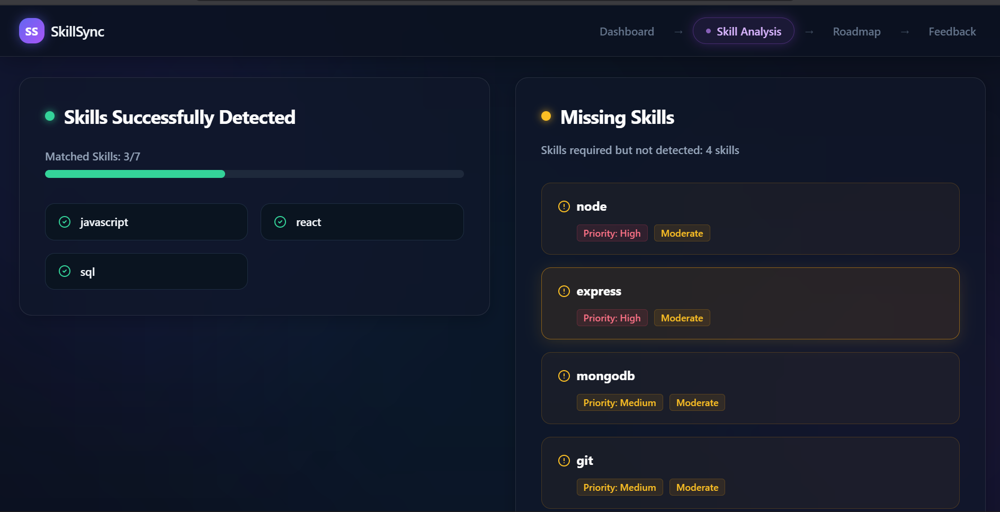

### Gap Analysis

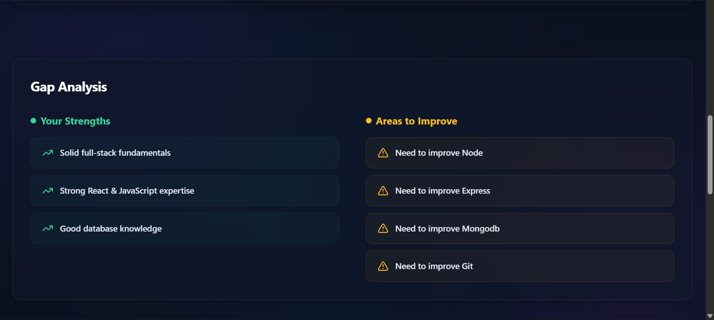

---

## Personalized Roadmap

### Roadmap Overview

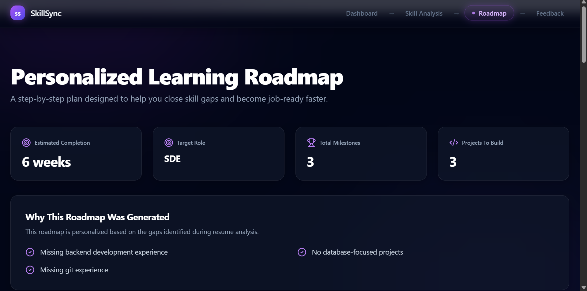

### Learning Modules

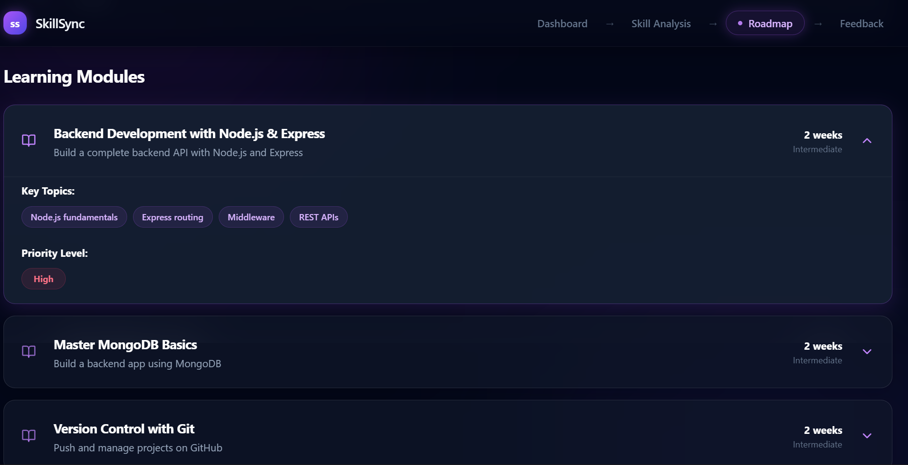

### Recommended Resources

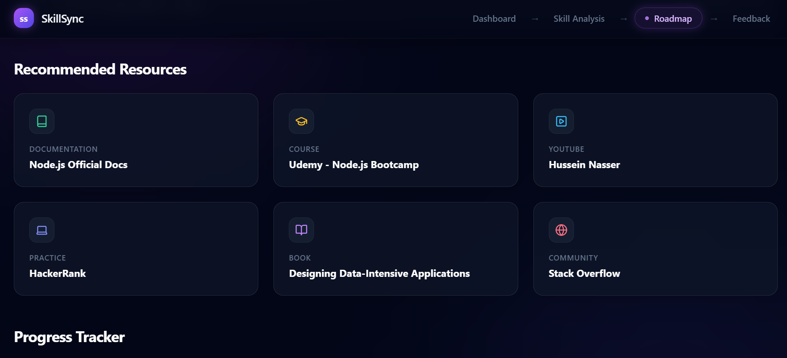

### Progress Tracker

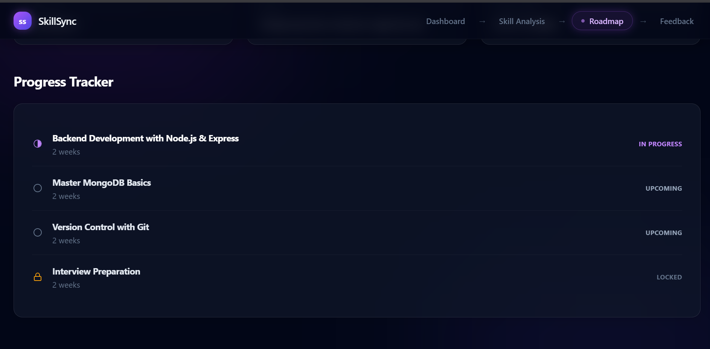

---

## Resume Feedback

### Priority Improvements

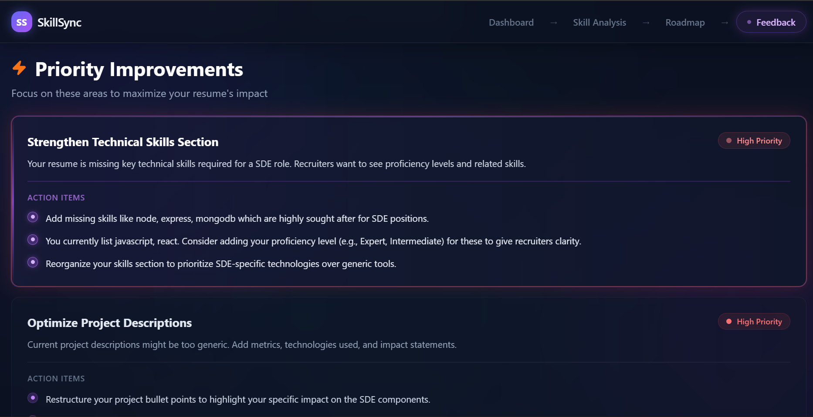

### Keyword Analysis

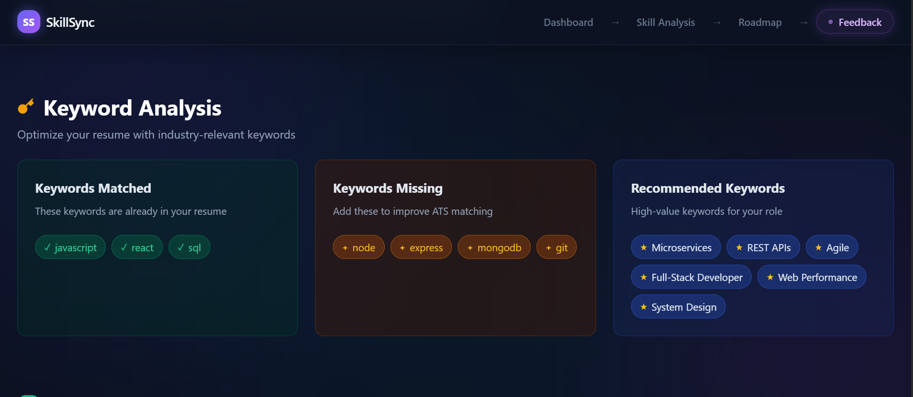

### Writing Tips

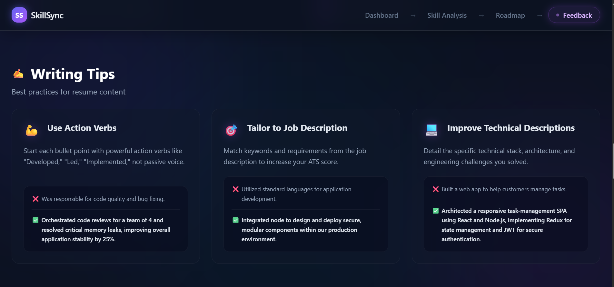

---

## Future Improvements

- OpenAI/Gemini powered feedback
- Authentication & User Profiles
- Saved Roadmaps
- Resume Version Tracking
- Interview Question Generator
- Export Roadmap as PDF

---
